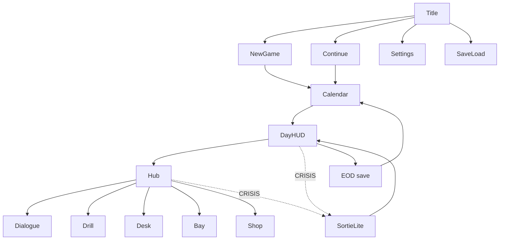

# ia.md — M2 화면 맵 (draft lock)

**#4 deliverable.** M2 스캐폴드가 따를 **잠긴 화면 목록 + 단순 흐름**. 코드 없음.

Beat IDs: [`../research/day-loop.md`](../research/day-loop.md).  
Stat / Voice / gaze: [`stats-and-relations.md`](stats-and-relations.md).  
픽션 이름: [`original-pitch.md`](original-pitch.md).

---

## 1. Locked screens · 잠긴 화면

| Screen ID | 목적 | M2 notes |
| --- | --- | --- |
| `Title` | 타이틀 / 워킹 타이틀 **누리학기** | Continue 가능 시 버튼 활성 |
| `NewGame` | 새 학기 | 슬롯·난이도·콘텐츠 플래그(`Bond` opt-in) |
| `Continue` | 이어하기 | 최근 세이브 로드 → `Calendar` |
| `Calendar` | 시즌 달력 + 오늘 날짜 | `WarHeat` 요약. 하루 입장 |
| `DayHUD` | 일과 HUD | Beat 스트립 + vitals + `Voice` |
| `Hub` | 학원 허브 맵 | FREE(및 일부 beat) 노드 이동 |
| `Dialogue` | 대화 / 제안 | `Voice` 지출. 분위기 태그 게이트 |
| `SortieLite` | 당직 전투 | **Auto 기본**. Manual은 이후 |
| `SaveLoad` | 세이브 / 로드 | `EOD`가 기본 체크포인트 |
| `Settings` | 설정 | time-skip, gaze privacy, a11y |

`CRISIS`는 독립 타이틀 화면이 아니라 **오버레이 → `SortieLite`**.

---

## 2. Day HUD beats · 일과 비트

HUD는 아래 순서를 **항상** 보여 준다.

`MORNING` → `BRIEF` → `BLOCK_A` → `MEAL` → `BLOCK_B` → `FREE` → `EOD`

| Beat | 화면 | 플레이어 동사 |
| --- | --- | --- |
| `MORNING` | `DayHUD` + 짧은 준비 | 로드아웃, 식사, 가벼운 말 |
| `BRIEF` | `DayHUD` | 출석, 계급 소식, `Voice` 수당 |
| `BLOCK_A` | `DayHUD` / 슬롯 | Role 수업 또는 당직 |
| `MEAL` | `DayHUD` + 시선 | 식사, 초대, gaze 반응 |
| `BLOCK_B` | `DayHUD` | 수업 또는 자유 |
| `FREE` | `Hub` | 노드 선택 (메인 에이전시) |
| `EOD` | `DayHUD` → 자동 | NPC 일정·`WarHeat`·decay · **세이브** |
| `CRISIS` | → `SortieLite` | 어디서든 히트 롤. 복귀는 직전 beat |

---

## 3. Hub nodes · 학원 맵 (최소)

`Hub`에 **최소 5 노드**. 라벨은 오리지널. 코드는 영어.

| Node ID | 라벨 | 동사 |
| --- | --- | --- |
| `Talk` | 대화 | `Dialogue` / 제안 (`Voice`) |
| `Drill` | 훈련 | `Focus`·스킬 골격 |
| `Desk` | 책상 | `Mind`, 진정 초안 (`Lead`) |
| `Bay` | 정비만 | `Pilot`/`Wrench` 로드아웃 |
| `Shop` | 상점 | 아이템 (오리지널만) |

M2는 노드 3개만 클릭돼도 되지만 **목록은 이 다섯으로 잠근다**.

---

## 4. Dialogue / proposal · 대화·제안

- 진입: `Talk` 노드 또는 HUD 근접 상호작용.
- 제안 동사는 `Voice`를 쓴다. `Voice < 0`이면 제안 불가 ([`stats-and-relations.md`](stats-and-relations.md)).
- 같은 날 같은 화제 반복 → 비용↑ / 성공↓.
- 장면 분위기 (`Neutral` `Serious` `Bright` `Low` `Drained` `Awkward` `Intimate`)가 동사를 잠근다.
- 시선 반응 마이크로 메뉴: 미소 / 끄덕 / 무시 / 떠나기. `Settings`의 privacy gaze가 켜지면 빔·마이크로 메뉴를 끈다.

---

## 5. SortieLite

- 기본 조작: **Auto** (이동/공격 굵게).
- Manual 콤보 문법은 **이 잠금에 없음** (원작 Action Code 표 이식 금지).
- 종료 후 직전 beat로 resume. 장비 교체는 `Bay`에서만 (전투 중 `SupplyPad`는 희귀 — M2 stub 불필요).

---

## 6. Save / Load

| 동작 | 규칙 |
| --- | --- |
| Auto-save | `EOD` 후 1슬롯 |
| Manual | `SaveLoad` 화면. Title에서도 진입 |
| Load | `Continue` 또는 `SaveLoad` → `Calendar` 또는 저장된 beat |
| 신규 | `NewGame`이 슬롯을 덮어쓸지 확인 |

---

## 7. Settings · 설정 (잠긴 토글)

| Setting ID | 하는 일 |
| --- | --- |
| `SkipToBeat` | 다음 beat로 시간 스킵 (접근성) |
| `PauseClock` | 학원 시계 일시정지 |
| `GazePrivacy` | 시선 빔·피시선 마이크로 메뉴 off |
| `AutoSortie` | `SortieLite` Auto 기본 (기본값 **on**) |
| `ReduceMotion` | 시선/전환 모션 감소 |
| `ColorblindLos` | 시선/LoS 색 대체 |

---

## 8. Simple flow · 단순 흐름

---

## 9. Out of scope for this lock

- 픽셀 와이어프레임, 컴포넌트 props, 라우터 코드
- 회의/진정 풀 UI, Manual 전투 문법, 상점 SKU
- 원작 화면 크롬 모사
