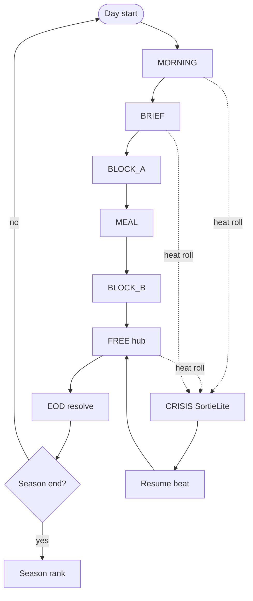

# day-loop.md — Day loop diagram (research → original)
# 하루 루프 도식 (조사 → 오리지널 재작성)

**#2 deliverable.** Reference shape from public GPM systems; **gpmlike names are original**.  
M2 screens that consume these beats: [`../design/ia.md`](../design/ia.md).

---

## A. Reference shape (GPM, summary only) · 참고 형태

```
[Wake / morning prep]
        ↓
[Homeroom / briefing beat]
        ↓
[Class block] ←→ (optional train/work if free)
        ↓
[Lunch social / eat]
        ↓
[Class or free block]
        ↓
[Free period: map nodes → talk / train / work / shop]
        ↓
[Sleep / EOD: grades · fatigue · warfront roll]
        ↓
   ↻ next calendar day

  ✕ interrupt anywhere in academy hours:
      [Surprise sortie] → battle resolve → resume day clock
```

**Public anchors:** Start ~08:30 realtime academy clock; campaign ~Mar 4 → May 10/11 survival; Mondays pay / Sundays freer (setting notes); combat often unscheduled (JP Wikipedia + Kimimi).

**Clock note:** Review ≈4 real sec ≈ 1 game minute — approximate; we invent our own tick.

---

## B. gpmlike original loop (lock draft) · 오리지널 루프 초안

**Season:** `SeasonLength` days (recommend **14–21** for web sessions; not GPM’s ~68).  
**Win:** Survive to `CeasefireDay` with platoon/war heat scoring — not a single boss kill.

### Beats (web-friendly)

| Beat ID | Player verbs | Time cost | Notes |
| --- | --- | --- | --- |
| `MORNING` | Loadout check, eat, light talk | Short | Prep before sirens |
| `BRIEF` | Attendance, rank news, petitions queue | Short | Soft currency payout |
| `BLOCK_A` | Class OR duty slot by Role | Medium | Raises/lowers Focus·Strain |
| `MEAL` | Eat, group invite, gaze reactions | Medium | Social density peak |
| `BLOCK_B` | Class / free | Medium | |
| `FREE` | Hub nodes: Talk · Drill · Desk · Bay · Shop | Long | Main agency |
| `EOD` | Auto resolve NPC schedules, war heat, decay | Instant | Save checkpoint |
| `CRISIS` | Interrupt → `SortieLite` | Variable | May fire in FREE/MORNING/after EOD bookkeeping |

### Mermaid (implementation map)



### Interrupt rules (original)

1. `WarHeat` (0–100) raises `CRISIS` chance; local wins lower heat, losses raise it.  
2. Player cannot re-equip mid-sortie except at a `SupplyPad` verb (rare).  
3. Ally `KIA` persists for the season (toggle soft-ironman later).  
4. Accessibility: `SkipToBeat`, pause clock, Auto sortie default.

---

## C. What we deliberately drop · 일부러 버리는 것

- Exact GPM date window / real city map brand names  
- Full petition/meeting bureaucracy in M0 (add after day loop ships)  
- Manual Action Code alphabet (invent our own grammar later)  
- Sock-collector / gag routes as core loop

---

## D. M0 acceptance · M0 완료 기준

- One day advances with MORNING→…→EOD and save.  
- At least one forced `CRISIS` stub that returns to FREE.  
- Three hub nodes callable in FREE.  
- No GPM character/mech/proper-noun strings in UI copy.
